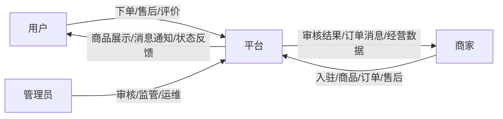
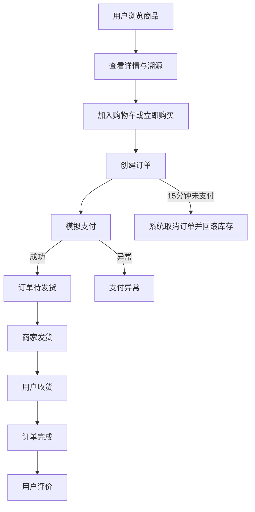
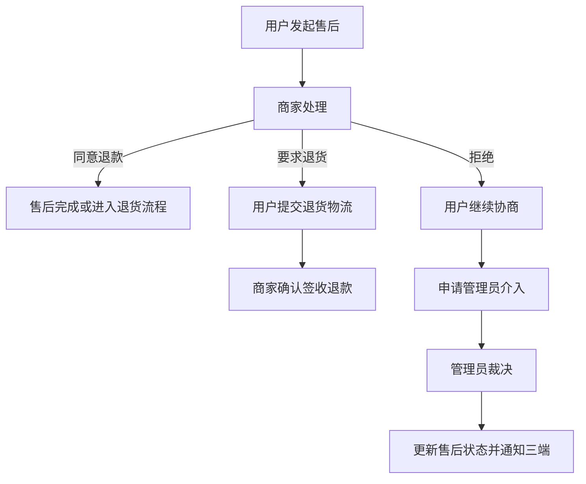
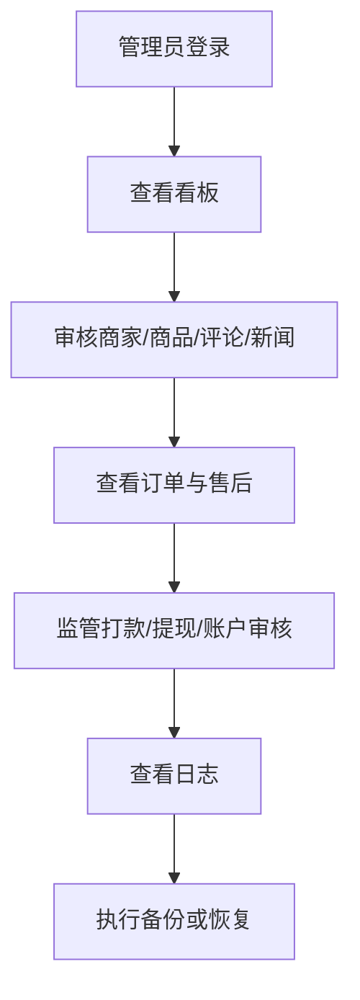
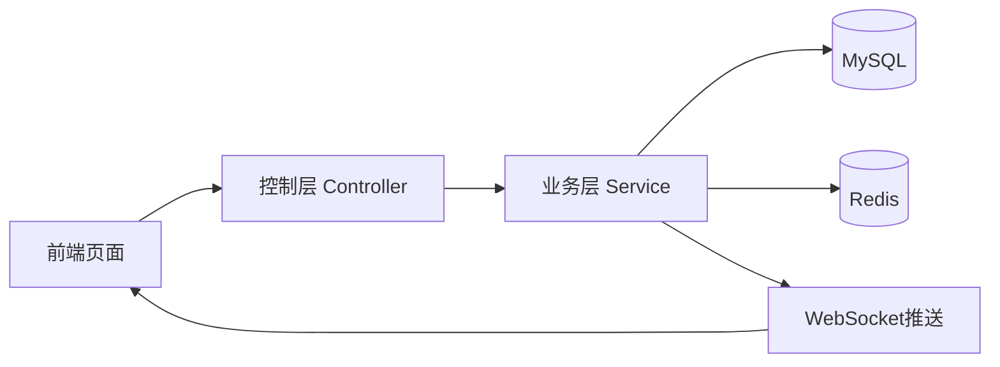
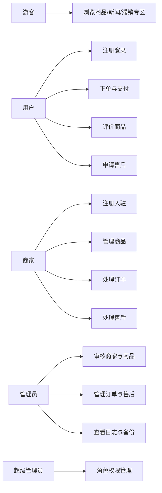
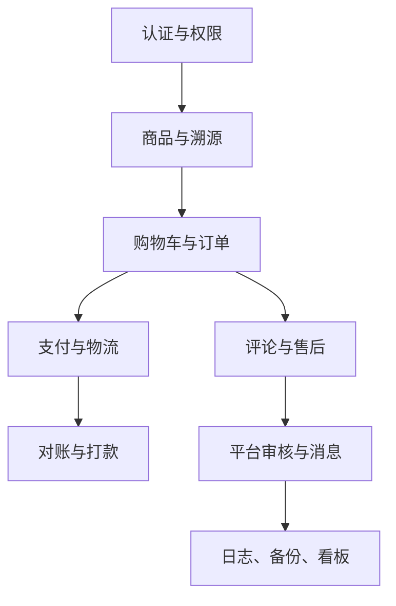

# 成都信息工程大学
Chengdu University of Information Technology
CUIT

# 本科毕业论文（设计）
# 需求规格说明书

| 学 生 姓 名 | 罗俊杰 |
| ---- | ---- |
| 学号 | 2022081092 |
| 专业 | 软件工程 |
| 年级班级 | 2022级3班 |
| 指导教师 | 刘孙俊（副教授） |
| 所在学院 | 软件工程学院 |
| 提交日期 | 2026年1月6日 |

2026 年 1 月  
成都信息工程大学 软件工程学院

---

# 目录
1 引言  
1.1 编制目的  
1.2 范围  
1.3 预期读者  
1.4 术语和缩略语  
1.5 文档约定  
1.6 参考资料  
2 项目概述  
2.1 建设目标  
2.2 系统范围  
2.3 用户特点  
2.4 假设与约束  
2.5 运行环境  
3 业务分析  
3.1 角色与组织关系  
3.2 核心业务流程  
4 用户需求  
4.1 总体功能  
4.2 用户端需求  
4.3 商家端需求  
4.4 管理员端需求  
4.5 公共支撑需求  
5 数据描述  
5.1 数据流程  
5.2 数据字典  
6 功能需求  
6.1 功能需求总述  
6.2 角色与权限需求  
6.3 状态流转需求  
6.4 关键功能需求说明  
6.5 需求可追踪矩阵  
7 系统用例分析  
7.1 角色分析  
7.2 用例图  
7.3 核心用例描述  
7.4 系统概念模型  
8 非功能需求  
8.1 性能需求  
8.2 安全保密需求  
8.3 扩展性需求  
8.4 稳定性需求  
8.5 部署需求  
9 界面要求  
9.1 图形要求  
9.2 报表要求  
9.3 其他要求

---

# 1 引言
## 1.1 编制目的
本文档用于定义“基于 Web 的助农产品销售系统”的功能需求、角色边界、数据流转、非功能需求及界面要求，为系统开发、测试、验收及毕业论文撰写提供统一依据。本文档的描述以当前前端和后端代码实现为事实来源，对尚未完全接入的第三方能力仅按模拟实现或预留扩展方式描述。

## 1.2 范围
软件名称：基于 Web 的助农产品销售系统。

系统采用 B/S 架构和前后端分离模式，面向普通消费者、农户/合作社和平台管理员三类主要角色，重点解决农产品线上展示、交易履约、商品溯源、售后协商、平台审核和后台治理等问题。

本系统当前不覆盖真实第三方支付清算、真实物流轨迹订阅和对象存储等重外部依赖能力，相关部分以模拟实现或扩展接口形式存在。

## 1.3 预期读者
1. 开发人员：重点阅读第 4、5、6、7 章。
2. 测试人员：重点阅读第 6、7、8 章。
3. 项目管理人员：重点阅读第 2、3、6、8 章。
4. 指导教师与评审人员：建议通读全文。
5. 文档撰写人员：重点参考本说明书与概要设计、数据库设计之间的一致性。

## 1.4 术语和缩略语
| 术语/缩略语 | 含义 |
| ---- | ---- |
| B/S 架构 | 浏览器/服务器架构 |
| 前后端分离 | 前端负责页面与交互，后端负责业务逻辑与数据访问 |
| JWT | JSON Web Token，用于身份认证 |
| Redis | 内存数据库，用于缓存和部分实时辅助数据 |
| WebSocket | 全双工通信协议，用于实时消息推送 |
| RBAC | 基于角色的访问控制模型 |
| 用户端 | 面向普通消费者的业务端 |
| 商家端 | 面向农户/合作社的经营端 |
| 管理员端 | 面向平台管理人员的后台管理端 |
| 溯源二维码 | 关联商品溯源信息的二维码链接 |
| 滞销专区 | 平台对重点帮扶商品进行集中展示的专区 |

## 1.5 文档约定
1. 需求条目采用“必须、应、可”表达优先级和约束强度。
2. 本文中的角色、状态、接口和数据结构以当前项目代码、数据库脚本和运行配置为准。
3. 图示采用 Mermaid 编写，便于 Markdown 维护与后续导出。
4. 文档中出现的“模拟支付”“短信验证码”“物流展示”等表述，均表示当前系统未完全对接真实第三方服务。

## 1.6 参考资料
1. 项目开题报告；
2. 可行性分析报告；
3. Spring Boot、Vue 3、MyBatis-Plus、Redis、Element Plus 官方文档；
4. 项目当前前端路由、页面、后端控制器、服务层、数据库脚本与配置文件；
5. 《中华人民共和国电子商务法》《中华人民共和国个人信息保护法》。

---

# 2 项目概述
## 2.1 建设目标
系统建设目标如下：

1. 为普通消费者提供便捷、可信、可溯源的农产品浏览和购买入口。
2. 为商家提供低门槛、流程完整的线上经营工具。
3. 为管理员提供审核、监管、日志、备份和权限控制能力。
4. 在本科毕业设计范围内完成业务闭环清晰、结构完整、可部署演示的 Web 系统。

## 2.2 系统范围
系统包括以下范围：

1. 用户端：注册登录、首页推荐、商品浏览、商品详情、购物车、订单、模拟支付、评论、售后、消息、新闻、滞销专区。
2. 商家端：注册登录、店铺维护、商品管理、溯源维护、订单处理、售后处理、统计、对账、收款账户、提现。
3. 管理员端：登录、看板、用户管理、商家审核、商品审核、订单监管、售后裁决、评论管理、新闻管理、角色权限、日志、备份、滞销专区、资金与提现监管。
4. 公共支撑：文件上传、地区和物流接口、短信验证码、Redis 缓存、WebSocket 实时消息、统一异常和统一响应结构。

## 2.3 用户特点
1. 普通消费者：希望购物流程简单、状态清晰、信息透明。
2. 农村用户：可能更偏移动端访问，倾向于更少输入和更明确提示。
3. 商家：计算机熟练度不一，但高频关注商品、订单、售后和收益。
4. 管理员：具备后台系统操作能力，关注审核、监管、日志和系统运行情况。

## 2.4 假设与约束
1. 系统运行依赖 MySQL、Redis 和稳定网络环境。
2. 用户可通过现代浏览器访问系统。
3. 支付、短信和物流外部能力当前允许采用模拟实现。
4. 项目须在毕业设计周期内完成主要实现和论文整理。
5. 技术栈固定为 Vue 3 + Spring Boot + MySQL + Redis，不进行大规模重构。

## 2.5 运行环境
1. 开发环境：Windows 11、JDK 17、Node.js、Maven、VS Code、IntelliJ IDEA。
2. 运行环境：Linux 或 Windows 服务器，MySQL 8.x，Redis 6.x。
3. 客户端环境：Chrome、Edge 等主流浏览器，兼容 PC 端并兼顾移动端浏览。

---

# 3 业务分析
## 3.1 角色与组织关系
系统主要包含游客、用户、商家、管理员和超级管理员五类角色。

1. 游客：浏览公开商品、新闻和滞销专区。
2. 用户：在游客能力基础上，新增购物车、订单、评论、售后和消息能力。
3. 商家：负责商品经营、订单履约、售后响应、账户和提现。
4. 管理员：负责审核、监管、内容治理和系统维护。
5. 超级管理员：拥有管理员后台的全部权限，并能够进行角色与权限配置。

角色之间的关系如下：

## 3.2 核心业务流程
### 3.2.1 交易履约流程

### 3.2.2 售后处理流程

### 3.2.3 平台治理流程

---

# 4 用户需求
## 4.1 总体功能
| 模块类别 | 目标描述 |
| ---- | ---- |
| 用户端 | 完成浏览、下单、支付、评价、售后、消息和资讯浏览 |
| 商家端 | 完成入驻、商品维护、订单履约、售后处理、经营统计和账户管理 |
| 管理员端 | 完成审核、监管、内容管理、权限控制、日志与备份 |
| 公共支撑 | 完成文件上传、验证码、缓存、实时消息、地区物流查询等支撑服务 |

## 4.2 用户端需求
1. 用户必须能够完成手机号注册、密码登录或验证码登录。
2. 用户必须能够查看首页推荐商品、热销商品、助农新闻和滞销专区。
3. 用户必须能够按关键词、分类、排序和产地等条件检索商品。
4. 用户必须能够查看商品详情、商家信息和溯源信息。
5. 用户必须能够加入购物车、提交订单并完成模拟支付。
6. 用户必须能够查看订单状态、订单沟通消息和物流信息。
7. 用户必须能够维护个人资料和收货地址。
8. 用户必须能够提交评价，并查看评论审核状态。
9. 用户必须能够发起售后、提交凭证、上传退货物流并申请管理员介入。
10. 用户应能够接收系统消息和实时状态刷新。
11. 用户应能够在商家主页查看基于该商家全部已审核评论汇总计算得到的商家评分。
12. 用户应能够在商家主页查看该商家全部商品的评论汇总，并支持跳转到对应商品详情或评价区域。
13. 用户应能够通过扫描商品二维码进入独立的溯源档案页面，而不是仅停留在商品详情页。

## 4.3 商家端需求
1. 商家必须能够注册并提交入驻资料。
2. 商家必须能够登录并查看审核状态。
3. 商家必须能够维护店铺信息和收款账户。
4. 商家必须能够新增、编辑、上下架商品，并维护商品溯源信息。
5. 商家必须能够处理订单、录入物流信息并查看订单沟通消息。
6. 商家必须能够处理售后申请和售后消息。
7. 商家必须能够查看销量、营收、订单状态分布和经营统计。
8. 商家必须能够查看对账明细、补贴明细并发起提现申请。
9. 商家应能够接收实时消息、未读提示和关键状态刷新。
10. 商家在维护商品时，应能够依据不同商品类别填写对应的特色溯源字段，如生鲜果蔬、粮油副食、干货特产、畜禽肉蛋等差异化信息。
11. 商家生成的溯源二维码应直接指向独立溯源档案路由，以支撑“一物一码”的展示闭环。

## 4.4 管理员端需求
1. 管理员必须能够通过账号、密码和验证码登录后台。
2. 管理员必须能够按照角色和权限访问后台菜单。
3. 管理员必须能够管理用户、审核商家、审核商品和审核评论。
4. 管理员必须能够管理助农新闻与滞销专区。
5. 管理员必须能够查看订单、售后、资金、收款账户和提现信息。
6. 管理员必须能够查看平台数据看板和风险监控信息。
7. 管理员必须能够查看系统日志、审核记录并执行数据备份。
8. 超级管理员必须能够管理角色与权限分配。

## 4.5 公共支撑需求
1. 系统必须提供统一文件上传接口。
2. 系统必须提供地区和物流相关公共接口。
3. 系统必须提供短信验证码逻辑。
4. 系统必须提供 Redis 缓存能力。
5. 系统应提供 WebSocket 实时消息通道。
6. 系统必须提供统一返回格式、统一异常处理和登录态解析能力。

---

# 5 数据描述
## 5.1 数据流程
系统核心数据流如下：

### 5.1.1 用户交易数据流
1. 用户在前端提交登录、购物、下单、支付、评价和售后请求。
2. 后端在业务层完成身份校验、库存校验、状态更新和消息推送。
3. MySQL 持久化订单、支付、评论、售后等核心数据。
4. Redis 缓存首页、商品详情、搜索结果和热门商品排行。
5. WebSocket 将订单和售后变更实时推送到用户端、商家端和管理员端。

### 5.1.2 平台治理数据流
1. 管理员审核业务数据并变更状态。
2. 系统写入审核记录和操作日志。
3. 相关业务状态通过实时事件刷新至三端页面。

## 5.2 数据字典
| 数据结构 | 含义说明 | 主要字段 |
| ---- | ---- | ---- |
| 用户信息 | 存储普通消费者账号与资料 | 用户ID、手机号、昵称、密码、状态 |
| 商家信息 | 存储商家账号和审核状态 | 商家ID、手机号、商家名称、审核状态、店铺状态 |
| 店铺信息 | 存储店铺展示资料 | 商家ID、店铺名称、简介、资质图 |
| 商品信息 | 存储商品基础属性 | 商品ID、商家ID、分类ID、价格、库存、状态 |
| 溯源信息 | 存储独立溯源码与全流程溯源信息 | 商品ID、溯源码、批次号、建档日期、采收/出栏日期、包装日期、检测说明、基础溯源字段、分类扩展字段 |
| 订单信息 | 存储订单主流程 | 订单号、用户ID、商家ID、金额、状态、地址 |
| 支付记录 | 存储支付与退款信息 | 订单号、支付方式、支付状态、退款状态 |
| 售后信息 | 存储退款退货流程 | 售后单号、订单号、类型、原因、状态 |
| 订单沟通 | 存储订单沟通消息 | 订单号、发送者类型、内容、媒体 |
| 用户消息 | 存储系统消息和通知 | 用户ID、标题、内容、关联类型、是否已读 |
| 审核记录 | 存储后台审核轨迹 | 业务类型、业务ID、审核人、审核状态 |
| 操作日志 | 存储管理员操作留痕 | 操作人、操作类型、业务类型、业务ID |

---

# 6 功能需求
## 6.1 功能需求总述
| 编号 | 功能名称 | 优先级 |
| ---- | ---- | ---- |
| SRS-USER-01 | 用户注册登录 | 高 |
| SRS-USER-02 | 首页推荐与商品搜索 | 高 |
| SRS-USER-03 | 商品详情与溯源 | 高 |
| SRS-USER-04 | 购物车与订单 | 高 |
| SRS-USER-05 | 模拟支付与物流 | 高 |
| SRS-USER-06 | 评论与售后 | 高 |
| SRS-USER-07 | 消息、新闻与滞销专区 | 中 |
| SRS-MER-01 | 商家入驻与店铺管理 | 高 |
| SRS-MER-02 | 商品与溯源管理 | 高 |
| SRS-MER-03 | 订单履约与售后处理 | 高 |
| SRS-MER-04 | 统计、对账、账户与提现 | 中 |
| SRS-ADM-01 | 后台登录与权限控制 | 高 |
| SRS-ADM-02 | 审核与内容管理 | 高 |
| SRS-ADM-03 | 订单、售后、资金监管 | 高 |
| SRS-ADM-04 | 日志、备份、看板与滞销专区 | 中 |
| SRS-COM-01 | 文件上传与公共服务 | 中 |
| SRS-COM-02 | 实时消息与缓存支撑 | 中 |

## 6.2 角色与权限需求
| 角色 | 权限范围 | 说明 |
| ---- | ---- | ---- |
| 游客 | 公开浏览 | 可访问首页、商品、新闻和滞销专区 |
| 用户 | 用户端个人业务 | 需通过用户登录态访问购物车、订单、售后、地址、消息等 |
| 商家 | 商家经营业务 | 需通过商家登录态访问店铺、商品、订单、售后、账户和提现等 |
| 管理员 | 后台管理业务 | 需通过管理员登录态访问后台模块 |
| 超级管理员 | 全部后台功能 | 额外拥有角色权限管理等高权限能力 |

权限控制需求如下：

1. 前端路由必须依据登录态和角色进行基础访问限制。
2. 后端必须通过 JWT 解析登录身份。
3. 后端必须通过登录类型拦截器校验用户端、商家端、管理员端接口边界。
4. 管理员端必须通过权限拦截器校验角色权限。
5. 管理员有效权限集必须支持从后端接口读取并与前端菜单显示保持一致。

角色访问边界矩阵如下：

| 访问主体 | 允许访问的主要范围 | 典型受限范围 |
| ---- | ---- | ---- |
| 游客 | 首页、商品列表、商品详情、新闻、滞销专区 | 购物车、订单、售后、后台页面 |
| 用户 | 用户端登录后页面与 `/user/**` 个人业务接口 | `/merchant/**`、`/admin/**` |
| 商家 | 商家后台页面与 `/merchant/**` 经营接口 | `/user/**` 个人业务、`/admin/**` |
| 管理员 | 管理员后台页面与 `/admin/**` 管理接口 | 用户和商家的个人业务接口 |
| 超级管理员 | 全部管理员后台模块 | 不直接替代用户或商家个人登录态 |

## 6.3 状态流转需求
### 6.3.1 订单状态
| 状态值 | 状态名称 | 说明 |
| ---- | ---- | ---- |
| 1 | 待付款 | 订单创建成功，等待支付 |
| 2 | 待发货 | 支付成功，等待商家发货 |
| 3 | 待收货 | 商家已发货 |
| 4 | 已完成 | 用户确认收货，订单完成 |
| 5 | 已取消 | 用户取消或超时取消 |
| 6 | 支付异常 | 支付失败或支付中断 |
| 7 | 售后中 | 订单存在进行中的售后 |
| 8 | 已完成售后 | 售后已结束 |

系统必须支持以下流转：

1. 创建订单后 15 分钟未支付，系统自动取消订单并回滚库存与销量。
2. 支付成功后，订单进入待发货状态。
3. 商家发货后，订单进入待收货状态。
4. 用户确认收货后，订单进入已完成状态。
5. 发起售后时，订单可进入售后中；售后完成后，订单可进入已完成售后。

### 6.3.2 商品状态
| 状态值 | 状态名称 |
| ---- | ---- |
| 0 | 待审核 |
| 1 | 已上架 |
| 2 | 已下架 |
| 3 | 已驳回 |

### 6.3.3 商家审核状态
| 状态值 | 状态名称 |
| ---- | ---- |
| 0 | 待审核 |
| 1 | 已通过 |
| 2 | 已驳回 |

### 6.3.4 售后状态
| 状态值 | 状态名称 | 说明 |
| ---- | ---- | ---- |
| 1 | 待商家处理 | 用户提交售后后等待商家处理 |
| 2 | 待商家签收退款 | 用户已提交退货信息，等待商家确认 |
| 3 | 已完成 | 售后结束 |
| 4 | 管理员介入 | 平台正在裁决 |
| 5 | 已驳回 | 商家或平台驳回申请 |
| 6 | 待用户退货 | 商家同意退货退款，等待用户寄回商品 |

### 6.3.5 提现状态
| 状态值 | 状态名称 |
| ---- | ---- |
| 0 | 待审核 |
| 1 | 待打款 |
| 2 | 已驳回 |
| 3 | 打款成功 |
| 4 | 打款失败待重试 |
| 5 | 打款失败人工处理 |
| 6 | 已取消 |

## 6.4 关键功能需求说明
### 6.4.1 用户注册登录
操作者：用户、商家、管理员。  
输入：手机号、密码、验证码。  
输出：登录结果、用户信息、令牌、角色信息。  
要求：

1. 用户端必须支持注册、验证码登录和密码登录。
2. 商家端必须支持注册、登录和审核状态查询。
3. 管理员端必须支持账号密码加验证码登录。
4. 退出登录后，前端登录态应失效。

### 6.4.2 商品浏览与详情
操作者：游客、用户。  
输入：关键词、分类、排序、商品 ID。  
输出：商品列表、商品详情、商家信息、溯源信息。  
要求：

1. 首页必须能展示推荐商品、热销商品、新闻和滞销专区摘要。
2. 商品列表必须支持分页和排序。
3. 商品详情必须展示图片、价格、库存、商家推荐和溯源信息。
4. 商品详情中的溯源信息必须支持跳转到独立的溯源档案页，而不能仅停留在商品详情页局部展示。
5. 溯源档案必须支持“一物一码”展示，至少包含溯源码、批次号、建档日期、采收/出栏日期、包装日期和检测说明。
6. 面向不同商品分类时，系统应支持展示分类特色溯源字段，如生鲜果蔬、粮油副食、干货特产、畜禽肉蛋四类商品的差异化溯源信息。
7. 商家主页必须展示商家综合评分，该评分应基于商家全部已审核评论的真实均值计算，而不是基于商品均分再次平均。
8. 商家主页必须展示该商家全部商品评论汇总，并支持从评论记录跳转到对应商品详情页。

### 6.4.3 购物车与下单
操作者：用户。  
输入：商品 ID、数量、地址 ID。  
输出：购物车项、订单信息。  
要求：

1. 加入购物车前必须校验商品状态和库存。
2. 创建订单时必须生成订单主表和订单明细。
3. 下单后必须扣减库存；超时取消时必须回滚库存。
4. 下单扣减库存时应采用原子条件更新方式，更新语句必须包含库存充足约束，防止并发场景下出现超卖。
5. 单次订单创建必须限定为同一商家的商品集合，以保证订单履约、售后和结算流程的一致性。

### 6.4.4 模拟支付与订单履约
操作者：用户、商家。  
输入：订单号、支付方式、物流信息。  
输出：支付记录、订单状态、物流信息。  
要求：

1. 支付阶段允许采用模拟支付。
2. 支付成功后订单状态必须更新为待发货。
3. 商家填写物流后，用户端订单详情和列表应实时更新。
4. 支付成功处理必须满足幂等性要求，同一订单在重复点击支付、前端重试或并发请求下，不得重复写入支付成功结果。
5. 单笔订单在业务上仅允许存在一条最终有效支付记录，支付记录应与订单号保持一对一约束关系。
6. 支付页和取消按钮在前端应具备防重复点击能力，避免在演示环境下因为连续点击产生重复请求。

### 6.4.5 评论与售后
操作者：用户、商家、管理员。  
输入：评分、评价内容、售后类型、原因、图片、物流号。  
输出：评论记录、售后单、沟通消息、裁决结果。  
要求：

1. 仅已完成订单可评价。
2. 评论必须支持审核状态管理。
3. 售后必须支持申请、沟通、退货物流提交和管理员介入。
4. 售后状态变更应通过实时事件刷新三端页面。
5. 同一订单在存在处理中售后时，不得重复发起新的处理中售后单。
6. 管理员处理退款或售后裁决时，必须校验当前业务状态是否允许流转，避免重复处理或越级处理。

### 6.4.6 审核与平台治理
操作者：管理员。  
输入：业务类型、业务 ID、审核结果、意见。  
输出：审核结果、审核记录、日志记录。  
要求：

1. 管理员必须能够审核商家、商品和评论。
2. 新闻和滞销专区内容必须可由管理员维护。
3. 后台重要操作必须写入操作日志或审核记录。
4. 管理员退款处理必须仅允许对“退款中”状态记录执行确认退款或退款失败操作，并同步写入退款金额、退款时间等关键字段。
5. 管理员审核、退款、打款等高风险操作在前端应具备防重复提交机制，在后端应具备状态校验机制。

### 6.4.7 数据备份与恢复
操作者：管理员、系统定时任务。  
输入：备份类型、备份文件编号。  
输出：备份文件、恢复结果。  
要求：

1. 系统必须支持每日自动备份。
2. 管理员必须能够手动创建备份文件。
3. 管理员必须能够基于已有备份文件执行恢复。
4. 备份文件应以 SQL 文本形式保存，便于查看和恢复。

### 6.4.8 自动打款与提现
操作者：系统、管理员、商家。  
输入：订单完成状态、商家账户信息、提现申请。  
输出：对账记录、提现状态、打款结果。  
要求：

1. 系统应每天自动扫描满足条件的已完成订单并尝试自动打款。
2. 商家提现申请必须经过后台审核和自动打款流程。
3. 商家收款账户必须经过小额验证与管理员审核后，才能参与自动打款或提现流程。
4. 自动打款与提现打款失败时，系统应保留失败次数、失败原因，并支持重试或人工兜底处理。

### 6.4.9 实时消息与状态刷新
操作者：用户、商家、管理员。  
输入：订单状态变更、售后状态变更、消息发送。  
输出：WebSocket 推送消息和页面实时刷新。  
要求：

1. 三端必须存在统一实时通知通道。
2. 订单和售后关键状态变更后，应向关联角色推送刷新事件。
3. 商家端未读消息和待办数量应在连接 WebSocket 时优先通过实时推送更新。
4. 订单实时沟通与统一刷新事件应分通道维护，以满足消息和页面刷新两类需求。

## 6.5 需求可追踪矩阵
为保证需求规格说明书、概要设计说明书和系统实现之间的一致性，核心需求与设计模块的对应关系如下：

| 需求编号 | 需求名称 | 对应设计模块 | 对应实现方向 |
| ---- | ---- | ---- | ---- |
| SRS-USER-03 | 商品详情与溯源 | DS-PROD-01 | 用户商品详情页、独立溯源档案页、商品溯源服务 |
| SRS-USER-04 | 购物车与订单 | DS-ORD-01 | 购物车、确认订单、订单服务、库存扣减 |
| SRS-USER-05 | 模拟支付与物流 | DS-ORD-01 | 支付页、支付记录、物流信息、订单状态流转 |
| SRS-USER-06 | 评论与售后 | DS-AFTER-01 | 评论审核、售后申请、售后沟通、管理员裁决 |
| SRS-MER-02 | 商品与溯源管理 | DS-PROD-01 | 商家商品发布、二维码生成、分类溯源字段维护 |
| SRS-MER-03 | 订单履约与售后处理 | DS-ORD-01 / DS-AFTER-01 | 商家订单、发货、售后处理、订单沟通 |
| SRS-ADM-02 | 审核与内容管理 | DS-AUDIT-01 | 商家审核、商品审核、评论审核、新闻管理 |
| SRS-ADM-03 | 订单、售后、资金监管 | DS-OPS-01 / DS-AFTER-01 | 订单监管、退款处理、打款、提现审核 |
| SRS-COM-02 | 实时消息与缓存支撑 | DS-AFTER-01 / DS-OPS-01 | Redis 缓存、WebSocket、实时刷新事件 |

---

# 7 系统用例分析
## 7.1 角色分析
1. 游客：访问公开资源。
2. 用户：完成商品购买、评价和售后。
3. 商家：完成经营履约和售后处理。
4. 管理员：完成审核、监管和系统维护。
5. 超级管理员：完成权限分配和全局后台管理。

## 7.2 用例图

## 7.3 核心用例描述
### 7.3.1 用例：用户下单支付
参与者：用户。  
前置条件：用户已登录，商品已上架且库存充足。  
主事件流：

1. 用户选择商品并提交订单；
2. 系统校验商品状态和库存；
3. 系统生成订单主表、订单明细并扣减库存；
4. 用户进入支付页执行模拟支付；
5. 支付成功后订单状态更新为待发货。

后置条件：订单和支付记录生成完成。

### 7.3.2 用例：商家发布商品
参与者：商家。  
前置条件：商家已登录且账号状态正常。  
主事件流：

1. 商家填写商品基础信息；
2. 上传商品图片并填写溯源信息；
3. 系统保存商品与溯源记录；
4. 商品进入待审核状态。

后置条件：商品待管理员审核。

### 7.3.3 用例：用户申请售后
参与者：用户。  
前置条件：订单为待收货、已完成或售后允许发起的状态。  
主事件流：

1. 用户选择售后类型和原因；
2. 上传凭证图片并提交；
3. 系统生成售后单；
4. 商家处理售后；
5. 如协商失败，用户申请管理员介入；
6. 管理员裁决并完成售后状态更新。

后置条件：售后单、沟通消息和状态轨迹被保存。

### 7.3.4 用例：管理员审核商品
参与者：管理员。  
前置条件：管理员已登录并具有审核权限。  
主事件流：

1. 管理员查看待审核商品；
2. 选择审核通过或驳回；
3. 系统更新商品状态；
4. 系统写入审核记录和操作日志。

后置条件：商品状态和审核轨迹更新。

### 7.3.5 用例：扫码查看溯源档案
参与者：用户、游客。  
前置条件：商品已存在有效溯源码并生成二维码。  
主事件流：

1. 用户通过移动端扫描商品二维码；
2. 浏览器打开独立溯源档案路由；
3. 系统依据溯源码查询商品溯源记录；
4. 系统返回基础溯源字段和分类特色溯源字段；
5. 用户查看溯源码、批次号、建档日期、检测说明和分类特色信息。

后置条件：用户成功查看独立溯源档案，形成“一物一码”的展示闭环。

## 7.4 系统概念模型

---

# 8 非功能需求
## 8.1 性能需求
1. 常规列表与详情接口在正常环境下应在 3 秒内响应。
2. 列表页面必须支持分页查询。
3. 首页、商品详情、新闻列表和热门商品等高频读取数据应支持 Redis 缓存。
4. 系统应支持订单和售后状态的实时刷新，减少手动刷新操作。
5. 面向答辩演示和轻量高并发场景，系统应能够正确处理重复点击、连续刷新和短时间多次请求，而不产生明显的数据错乱。

## 8.2 安全保密需求
1. 密码必须加密存储。
2. 系统必须使用 JWT 进行身份认证。
3. 用户、商家和管理员接口必须具有登录类型校验。
4. 管理员端必须具有角色权限校验。
5. 后台关键操作必须记录日志。
6. 验证码应具备时效性，且仅用于有限验证场景。

## 8.3 扩展性需求
1. 系统应便于后续接入真实支付、短信、物流和对象存储服务。
2. 前端应支持按角色或模块继续增加页面。
3. 后端应支持继续扩展控制器、服务层和定时任务。
4. 实时推送能力应支持新增事件类型。

## 8.4 稳定性需求
1. 系统应提供统一异常处理，返回明确错误信息。
2. 核心订单与售后流程必须在事务控制下保证一致性。
3. 超时取消、自动打款和备份任务必须能够独立运行。
4. 缓存失效后系统应仍能回源数据库完成查询。
5. 关键按钮如支付、取消订单、商家发货、管理员退款等应在界面层支持防连点处理，在服务层支持状态校验与幂等控制。

## 8.5 部署需求
1. 系统采用前后端分离部署。
2. 前端可作为静态资源部署，后端以 Spring Boot 服务运行。
3. 后端默认通过 `/api` 对外提供服务。
4. 生产环境建议配合 Nginx、HTTPS、数据库备份和日志监控。

---

# 9 界面要求
## 9.1 图形要求
1. 界面命名清晰、按钮语义明确。
2. 用户端和商家端应尽量降低输入复杂度。
3. 关键状态必须使用标签、颜色或时间线展示。
4. 商品图片、售后凭证和新闻封面应有稳定显示机制。
5. 管理员后台菜单应支持较小屏幕下的滚动访问。

## 9.2 报表要求
1. 数据看板应展示总用户数、总商家数、订单数和营收等核心指标。
2. 对账、打款、提现等页面应明确显示金额、时间和状态。
3. 日志页面应支持时间与类型筛选。

## 9.3 其他要求
1. 页面应具备空状态、错误提示和成功提示。
2. 关键流程页面应支持实时刷新或及时同步状态。
3. 系统整体风格应保持统一，便于论文演示和答辩展示。
