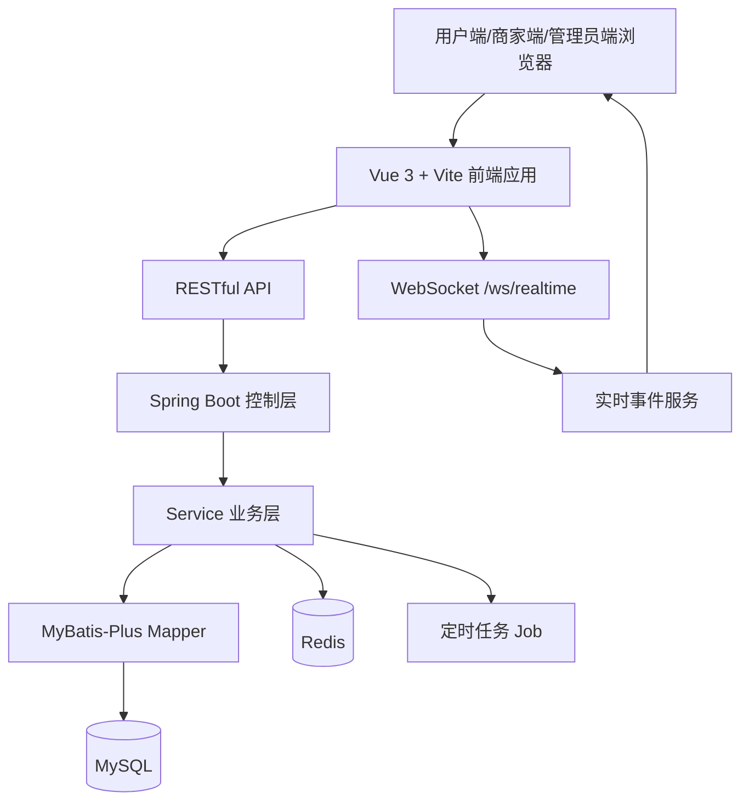
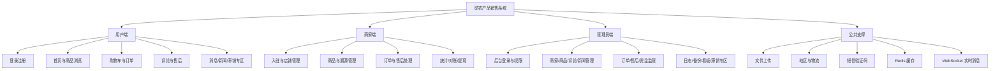
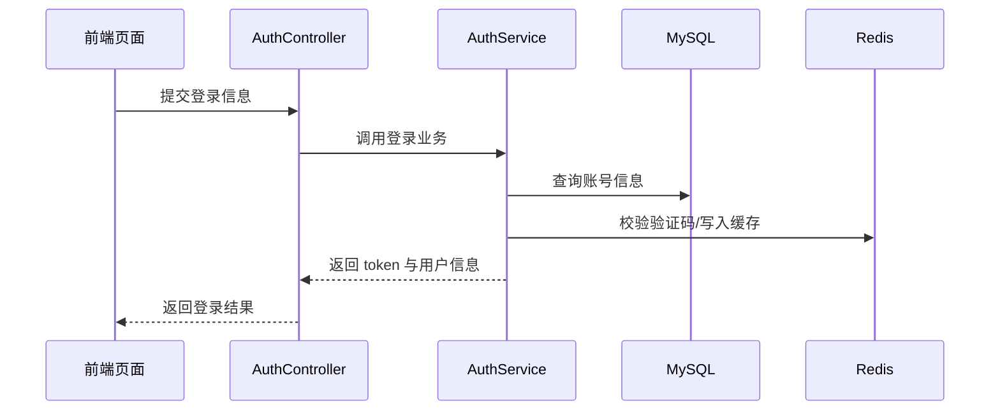
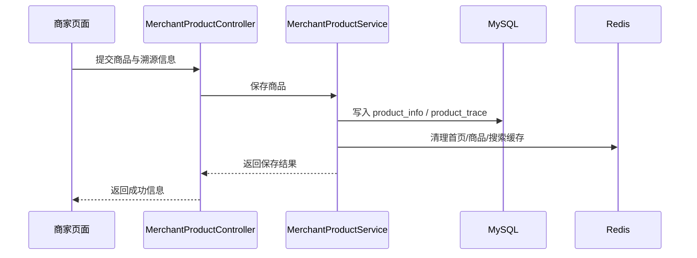
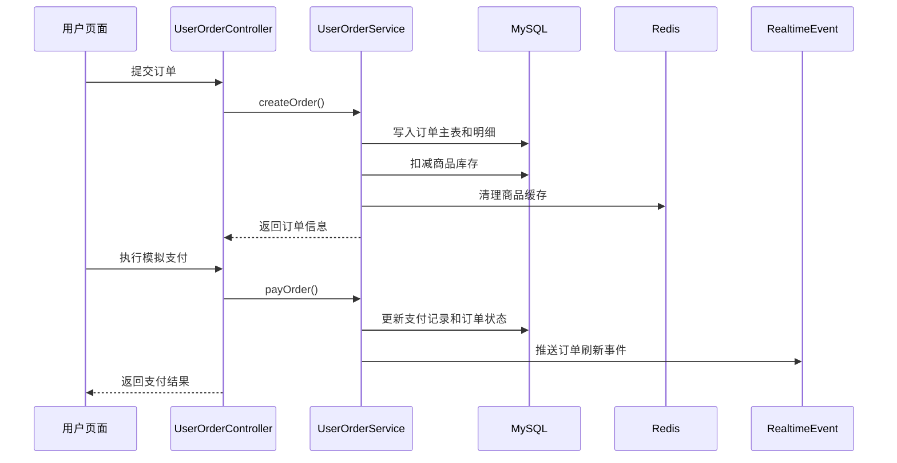
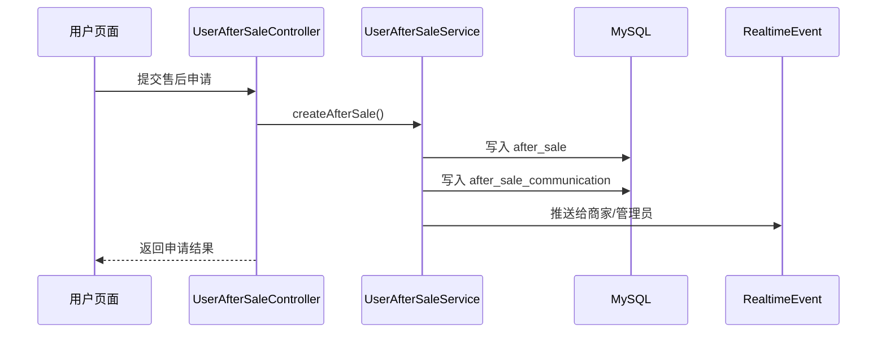
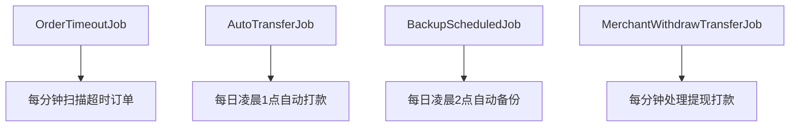
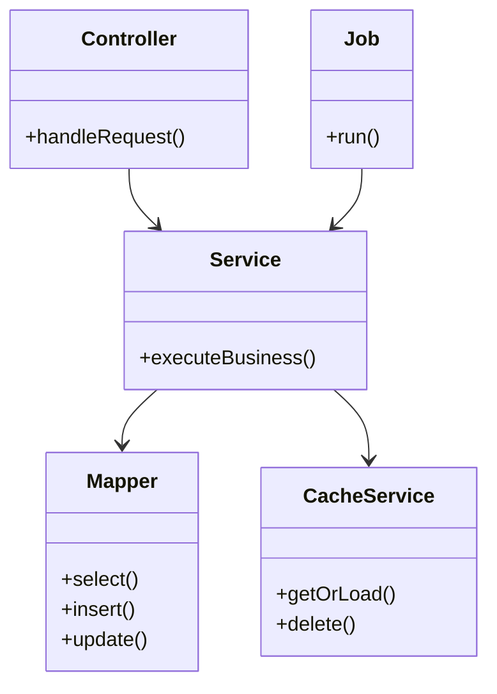

# 成都信息工程大学
Chengdu University of Information Technology
CUIT

# 本科毕业论文（设计）
# 概要设计说明书

| 学 生 姓 名 | 罗俊杰 |
| ---- | ---- |
| 学号 | 2022081092 |
| 专业 | 软件工程 |
| 年级班级 | 2022级3班 |
| 指导教师 | 刘孙俊（副教授） |
| 所在学院 | 软件工程学院 |
| 提交日期 | 2026年3月 |

2026 年 3 月  
成都信息工程大学 软件工程学院

---

# 目录
1 引言  
1.1 编写目的  
1.2 项目背景  
1.3 术语  
1.4 参考资料  
2 总体设计  
2.1 系统体系结构  
2.2 系统总体功能结构  
2.3 运行环境  
2.4 系统关键技术  
3 功能模块设计说明  
3.1 功能模块列表  
3.2 认证与权限模块  
3.3 商品与溯源模块  
3.4 订单与支付模块  
3.5 售后与消息模块  
3.6 审核与内容管理模块  
3.7 统计、日志、备份与定时任务模块  
4 视图设计  
4.1 界面风格设计  
4.2 主界面设计  
5 内部接口设计  
5.1 接口总体说明  
5.2 认证与权限接口  
5.3 商品与订单接口  
5.4 实时消息与定时任务接口  
6 系统出错处理设计  
6.1 出错信息  
6.2 补救措施

---

# 1 引言
## 1.1 编写目的
本文档用于说明“基于 Web 的助农产品销售系统”的总体架构、主要功能模块、内部接口与关键技术实现方案，为系统实现、测试、维护和论文撰写提供设计依据。

本文档的预期读者包括项目开发人员、测试人员、指导教师及评审人员。

## 1.2 项目背景
本系统面向助农电商业务场景，采用前后端分离方式实现用户端、商家端和管理员端三端协同。系统重点解决农产品展示、溯源、交易、售后、审核、资金监管和平台治理等问题，并在本科毕业设计范围内形成结构完整、功能闭环清晰的 Web 软件系统。

## 1.3 术语
| 术语 | 说明 |
| ---- | ---- |
| 用户端 | 面向普通消费者的前端业务界面 |
| 商家端 | 面向农户/合作社的经营后台 |
| 管理员端 | 面向平台管理人员的管理后台 |
| WebSocket | 用于三端实时消息与状态刷新 |
| JWT | 用于身份认证的令牌 |
| RBAC | 基于角色的权限控制 |
| Redis 缓存 | 用于热点数据和权限、排行等缓存 |

## 1.4 参考资料
1. 可行性分析报告；
2. 需求规格说明书；
3. 数据库设计说明书；
4. 当前项目代码、数据库脚本与配置文件；
5. Spring Boot、Vue 3、MyBatis-Plus、Redis 官方文档。

---

# 2 总体设计
## 2.1 系统体系结构
本系统采用前后端分离的单体应用架构。前端通过 Vue 3 实现三端页面与交互，后端通过 Spring Boot 提供 RESTful API 和 WebSocket 服务，MySQL 负责持久化数据存储，Redis 负责缓存和实时辅助数据处理。



系统运行原理如下：

1. 前端根据角色加载对应布局与业务页面。
2. 后端控制层接收请求并完成参数校验、登录校验和权限校验。
3. 业务层完成商品、订单、售后、审核、日志和备份等业务处理。
4. 数据层通过 MyBatis-Plus 完成数据库访问。
5. Redis 用于公共数据缓存、热门商品排行和权限缓存。
6. WebSocket 用于订单、售后和消息状态的实时推送。
7. 定时任务负责订单超时取消、自动打款、自动备份和提现打款重试。

## 2.2 系统总体功能结构


为便于将设计说明与实际代码结构对应，系统实现层面的模块映射关系可概括如下：

| 设计层模块 | 前端主要承载位置 | 后端主要承载位置 |
| ---- | ---- | ---- |
| 用户端业务 | `layout/UserLayout.vue`、`views/user/*` | `controller/user`、`service/user` |
| 商家端业务 | `layout/MerchantLayout.vue`、`views/merchant/*` | `controller/merchant`、`service/merchant` |
| 管理员端业务 | `layout/AdminLayout.vue`、`views/admin/*` | `controller/admin`、`service/admin` |
| 公共支撑能力 | `apis/*`、`utils/*`、`stores/*` | `controller/common`、`service/common`、`config` |

系统在代码组织上还体现出如下实现特征：

1. 前端通过路由按角色切分页面入口，通过布局组件统一承载导航、实时消息和公共状态。
2. 后端通过控制层分角色提供接口，通过业务层完成核心逻辑，通过配置层完成鉴权、拦截器和 WebSocket 注册。
3. 定时任务、实时事件服务和缓存服务均作为独立能力模块存在，未与单一业务页面强耦合。

## 2.3 运行环境
### 2.3.1 硬件环境
1. 服务器：普通 PC 或轻量云服务器即可完成演示部署。
2. 客户端：支持现代浏览器的 PC 或移动终端。

### 2.3.2 软件环境
1. 操作系统：Windows 11 或 Linux。
2. 开发环境：JDK 17、Node.js、Maven、MySQL 8.x、Redis 6.x。
3. 前端技术：Vue 3、Vite、Pinia、Element Plus、TypeScript。
4. 后端技术：Spring Boot、MyBatis-Plus、Lombok、JWT、Swagger/OpenAPI。

## 2.4 系统关键技术
1. 前后端分离：前端负责页面渲染和交互，后端负责 API 与业务处理。
2. JWT 认证：实现用户、商家、管理员三类身份登录。
3. 登录类型拦截与权限拦截：分别保证接口的角色边界和后台权限边界。
4. Redis 缓存：缓存首页、商品详情、搜索结果、新闻列表和权限数据。
5. WebSocket 实时通信：推动订单、售后、消息等状态实时更新。
6. 定时任务：支持订单超时取消、自动打款、自动备份和提现打款重试。
7. 商品溯源二维码：基于商品溯源信息生成二维码链接。

从当前代码实现看，上述关键技术已对应到明确的实现载体：

1. 认证由三端登录控制器与 JWT 解析组件完成；
2. 角色边界由登录类型拦截器完成；
3. 管理员权限边界由权限拦截器和权限服务完成；
4. WebSocket 由 `/ws/realtime` 和 `/ws/order-chat` 两条通道组成；
5. 定时任务由 `OrderTimeoutJob`、`AutoTransferJob`、`BackupScheduledJob`、`MerchantWithdrawTransferJob` 实现。

---

# 3 功能模块设计说明
## 3.1 功能模块列表
| 模块编号 | 模块名称 | 对应需求编号 | 说明 | 优先级 |
| ---- | ---- | ---- | ---- | ---- |
| DS-AUTH-01 | 认证与权限模块 | SRS-USER-01 / SRS-MER-01 / SRS-ADM-01 | 负责三端登录、JWT、登录类型校验、权限控制 | 高 |
| DS-PROD-01 | 商品与溯源模块 | SRS-USER-02 / SRS-USER-03 / SRS-MER-02 | 负责商品展示、管理和溯源信息维护 | 高 |
| DS-ORD-01 | 订单与支付模块 | SRS-USER-04 / SRS-USER-05 / SRS-MER-03 | 负责购物车、下单、支付、物流和订单状态流转 | 高 |
| DS-AFTER-01 | 售后与消息模块 | SRS-USER-06 / SRS-MER-03 / SRS-COM-02 | 负责售后流程、沟通消息和实时刷新 | 高 |
| DS-AUDIT-01 | 审核与内容管理模块 | SRS-ADM-02 | 负责商家、商品、评论、新闻和滞销专区管理 | 高 |
| DS-OPS-01 | 统计与运维模块 | SRS-MER-04 / SRS-ADM-03 / SRS-ADM-04 | 负责统计、打款、提现、日志、备份和任务调度 | 中 |

## 3.2 认证与权限模块
### 3.2.1 模块描述
认证与权限模块负责处理用户、商家、管理员三端登录认证，解析 JWT 登录态，并在服务端校验登录身份和管理员权限。

### 3.2.2 操作者
用户、商家、管理员、超级管理员。

### 3.2.3 相关数据表
| 名称 | 中文说明 | 类型 | 作用 |
| ---- | ---- | ---- | ---- |
| user_info | 用户表 | 表 | 用户登录与资料维护 |
| merchant_info | 商家表 | 表 | 商家登录与审核状态 |
| sys_user | 管理员表 | 表 | 管理员登录 |
| sys_role | 角色表 | 表 | 后台角色定义 |
| sys_permission | 权限表 | 表 | 后台权限定义 |
| sys_role_permission | 角色权限关联表 | 表 | 角色与权限绑定 |

### 3.2.4 输入与输出
输入：手机号、密码、验证码、登录角色。  
输出：登录结果、Token、用户资料、当前权限集合。

### 3.2.5 核心处理逻辑
1. 用户端支持注册、密码登录、验证码登录。
2. 商家端支持注册、登录和审核状态查询。
3. 管理员端支持账号密码加验证码登录。
4. 后端通过 `LoginTypeInterceptor` 限制用户、商家和管理员接口边界。
5. 后端通过 `AdminPermissionInterceptor` 限制管理员权限访问。

### 3.2.6 对象时序图


## 3.3 商品与溯源模块
### 3.3.1 模块描述
商品与溯源模块负责商品分类、商品发布、商品展示、商家推荐和溯源信息维护。

### 3.3.2 操作者
游客、用户、商家、管理员。

### 3.3.3 相关数据表
| 名称 | 中文说明 | 作用 |
| ---- | ---- | ---- |
| product_category | 商品分类表 | 维护分类体系 |
| product_info | 商品信息表 | 存储商品基本信息 |
| product_trace | 商品溯源表 | 存储种植与运输信息 |
| shop_info | 店铺信息表 | 商家店铺展示 |

### 3.3.4 输入与输出
输入：商品名称、分类、价格、库存、图片、溯源信息。  
输出：商品列表、商品详情、溯源二维码、商家推荐商品。

### 3.3.5 算法与规则
1. 商品详情页的商家推荐以当前商家销量较高的商品为基础。
2. 滞销专区展示结果由管理员手动配置和算法推荐共同决定。
3. 热门商品排行由 Redis ZSet 维护销量分值。

### 3.3.6 时序图


## 3.4 订单与支付模块
### 3.4.1 模块描述
订单与支付模块负责购物车管理、订单创建、模拟支付、物流填写、收货确认和订单状态流转。

### 3.4.2 操作者
用户、商家、管理员。

### 3.4.3 相关数据表
| 名称 | 中文说明 | 作用 |
| ---- | ---- | ---- |
| cart | 购物车表 | 存储加购商品 |
| order_main | 订单主表 | 存储订单状态与金额 |
| order_item | 订单明细表 | 存储商品项 |
| payment_record | 支付记录表 | 存储模拟支付与退款信息 |
| logistics_info | 物流信息表 | 存储发货信息 |
| reconciliation_detail | 对账明细表 | 存储商家收入打款信息 |

### 3.4.4 输入与输出
输入：商品 ID、数量、地址 ID、支付方式、物流单号。  
输出：订单号、支付结果、订单状态、物流信息。

### 3.4.5 核心规则
1. 下单前必须校验商品是否上架、库存是否充足。
2. 创建订单后系统立即扣减库存。
3. 15 分钟内未支付则由定时任务自动取消订单并回滚库存与销量。
4. 支付当前为模拟实现，但支付记录和状态流转已完整保留。
5. 用户确认收货后，订单进入已完成状态，为自动打款提供依据。

### 3.4.6 下单支付时序图


## 3.5 售后与消息模块
### 3.5.1 模块描述
售后与消息模块负责用户售后申请、商家售后处理、管理员裁决、订单沟通、售后沟通和用户消息通知。

### 3.5.2 操作者
用户、商家、管理员。

### 3.5.3 相关数据表
| 名称 | 中文说明 | 作用 |
| ---- | ---- | ---- |
| after_sale | 售后表 | 售后状态流转 |
| after_sale_communication | 售后沟通表 | 售后消息 |
| order_communication | 订单沟通表 | 订单实时沟通 |
| user_message | 用户消息表 | 用户通知消息 |

### 3.5.4 输入与输出
输入：售后类型、原因、凭证图片、退货物流、消息内容。  
输出：售后状态、沟通记录、未读消息数、裁决结果。

### 3.5.5 核心规则
1. 售后支持仅退款、退货退款和换货。
2. 售后状态支持商家处理、待用户退货、待商家签收退款、管理员介入和完成等阶段。
3. 订单和售后消息通过 WebSocket 实现实时刷新。
4. 售后状态变更需要同步刷新用户端、商家端和管理员端。

### 3.5.6 售后时序图


## 3.6 审核与内容管理模块
### 3.6.1 模块描述
审核与内容管理模块负责商家审核、商品审核、评论审核、新闻管理和滞销专区管理。

### 3.6.2 操作者
管理员、超级管理员。

### 3.6.3 相关数据表
| 名称 | 中文说明 |
| ---- | ---- |
| merchant_info | 商家审核对象 |
| product_info | 商品审核对象 |
| comment | 评论审核对象 |
| news | 新闻内容 |
| news_category | 新闻分类 |
| audit_record | 审核记录 |
| sys_operation_log | 操作日志 |

### 3.6.4 核心设计
1. 审核动作统一由管理员后台发起。
2. 审核结果写入业务表状态字段，同时记录审核轨迹。
3. 后台内容操作应写入操作日志。
4. 滞销专区支持管理员手动管理，并结合算法推荐结果展示。

## 3.7 统计、日志、备份与定时任务模块
### 3.7.1 模块描述
该模块负责商家统计、平台看板、日志审计、数据备份和系统定时任务。

### 3.7.2 操作者
商家、管理员、系统定时任务。

### 3.7.3 相关数据表
| 名称 | 中文说明 |
| ---- | ---- |
| reconciliation_detail | 对账明细 |
| merchant_withdraw | 提现申请 |
| subsidy_detail | 补贴明细 |
| sys_operation_log | 操作日志 |

### 3.7.4 定时任务设计


### 3.7.5 实时消息设计
系统实时能力由“订单沟通通道”和“统一刷新通道”两部分组成：

```mermaid
flowchart LR
    A[订单/售后/审核状态变化] --> B[RealtimeEventService]
    B --> C[/ws/realtime]
    D[订单聊天消息] --> E[OrderCommunicationService]
    E --> F[/ws/order-chat]
    C --> G[用户端/商家端/管理员端布局]
    F --> H[订单沟通面板]
```

设计要点如下：

1. `/ws/realtime` 负责页面状态刷新，不直接承载订单聊天正文。
2. `/ws/order-chat` 负责订单沟通类消息内容传输。
3. 三端布局组件负责监听实时事件，并转发到具体页面完成局部刷新。

### 3.7.6 类关系示意


---

# 4 视图设计
## 4.1 界面风格设计
系统界面采用清晰、简洁、信息层级明确的设计风格，整体要求如下：

1. 用户端以商品内容为主，强调图片展示、价格信息和状态标签。
2. 商家端以表格、卡片和表单为主，突出订单、售后和经营数据。
3. 管理员端以后台菜单和统计面板为主，突出审核、监管和日志。
4. 关键流程页面使用颜色标签、时间线、卡片和弹窗引导用户完成操作。

## 4.2 主界面设计
1. 用户端主界面：包含首页、商品列表、商品详情、购物车、订单和个人中心。
2. 商家端主界面：包含控制台、商品管理、订单管理、售后处理、统计和账户页面。
3. 管理员端主界面：包含看板、审核页、订单监管、日志、备份和角色权限页面。

---

# 5 内部接口设计
## 5.1 接口总体说明
系统内部接口主要表现为控制层到服务层、服务层到数据层、服务层到缓存层以及服务层到实时事件服务之间的调用关系，不局限于单个 REST 路径。

| 模块 | 接口类型 | 说明 |
| ---- | ---- | ---- |
| 认证与权限 | 内部 | 登录、Token 解析、登录类型校验、权限校验 |
| 商品与溯源 | 内部 | 商品查询、缓存读取、溯源生成 |
| 订单与支付 | 内部 | 下单、支付、库存变更、订单状态更新 |
| 售后与消息 | 内部 | 售后创建、消息写入、实时推送 |
| 运维与任务 | 内部 | 自动打款、备份、日志与缓存失效 |

这些内部接口的共同特点是：

1. 控制层负责参数接收、登录校验和结果封装。
2. 业务层负责事务、状态流转、缓存清理和事件发布。
3. 数据层负责表访问与持久化。
4. 实时事件服务与定时任务服务对外不直接暴露页面，而作为跨模块协同能力存在。

## 5.2 认证与权限接口
| 接口编号 | 接口名称 | 调用者 | 说明 |
| ---- | ---- | ---- | ---- |
| IF-AUTH-01 | 登录认证接口 | 前端登录页 | 返回 token 与用户信息 |
| IF-AUTH-02 | 登录类型校验接口 | 控制层拦截器 | 确保用户访问正确角色接口 |
| IF-AUTH-03 | 管理员权限校验接口 | 后台拦截器 | 校验管理员是否具备指定权限 |

## 5.3 商品与订单接口
| 接口编号 | 接口名称 | 调用者 | 说明 |
| ---- | ---- | ---- | ---- |
| IF-PROD-01 | 商品查询接口 | 首页、商品列表、详情页 | 读取数据库和缓存 |
| IF-ORD-01 | 订单创建接口 | 用户下单页 | 创建订单、明细和库存扣减 |
| IF-ORD-02 | 模拟支付接口 | 支付页 | 更新支付记录和订单状态 |
| IF-ORD-03 | 商家发货接口 | 商家订单页 | 写入物流并更新订单状态 |

## 5.4 实时消息与定时任务接口
| 接口编号 | 接口名称 | 调用者 | 说明 |
| ---- | ---- | ---- | ---- |
| IF-RT-01 | WebSocket 实时推送接口 | 三端布局页 | 接收刷新事件 |
| IF-JOB-01 | 订单超时任务接口 | 定时任务 | 自动取消超时订单 |
| IF-JOB-02 | 自动打款任务接口 | 定时任务 | 自动生成对账和打款记录 |
| IF-JOB-03 | 自动备份任务接口 | 定时任务 | 生成 SQL 备份文件 |

---

# 6 系统出错处理设计
## 6.1 出错信息
| 序号 | 出错场景 | 系统输出及处理 |
| ---- | ---- | ---- |
| 1 | 未登录访问受限页面 | 前端跳转至对应登录页，后端返回未授权信息 |
| 2 | 登录角色错误 | 后端返回“请先以对应身份登录” |
| 3 | 权限不足访问后台接口 | 后端返回禁止访问信息 |
| 4 | 商品下架或库存不足 | 返回错误提示并阻止下单 |
| 5 | 订单超时未支付 | 系统自动取消并回滚库存 |
| 6 | 支付异常 | 返回支付异常提示并允许重新支付 |
| 7 | 售后状态不允许当前操作 | 返回明确业务提示 |
| 8 | 备份或打款任务失败 | 记录日志并保留重试或人工处理状态 |

## 6.2 补救措施
1. 前端通过表单校验、提示消息和状态标签降低误操作概率。
2. 后端通过统一异常处理返回明确错误信息。
3. 订单和售后关键流程使用事务控制保证数据一致性。
4. 实时消息连接异常时，前端可以通过轮询或刷新重新同步状态。
5. 自动打款和提现打款任务支持失败重试或人工兜底。
