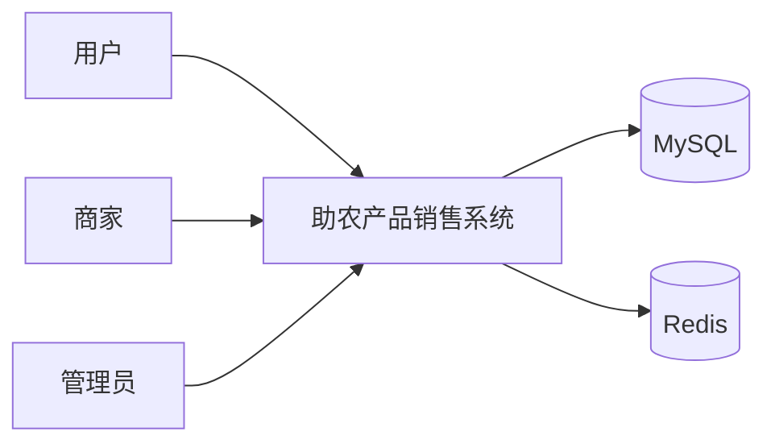
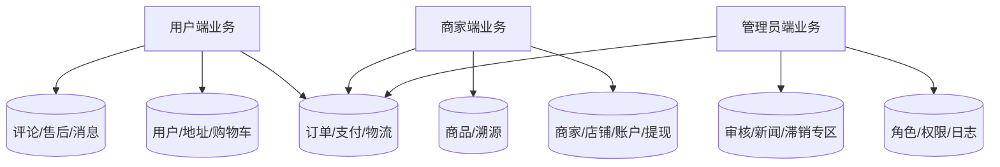
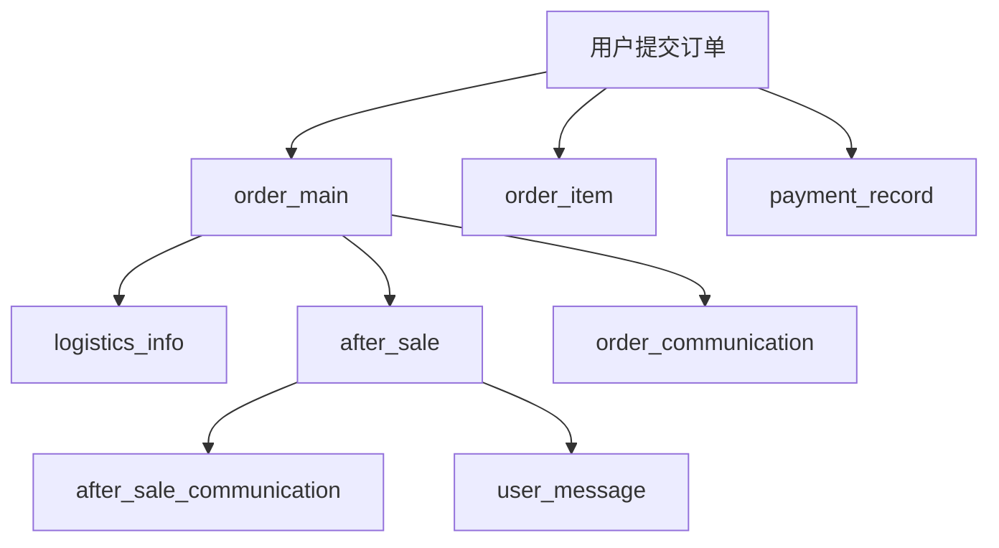
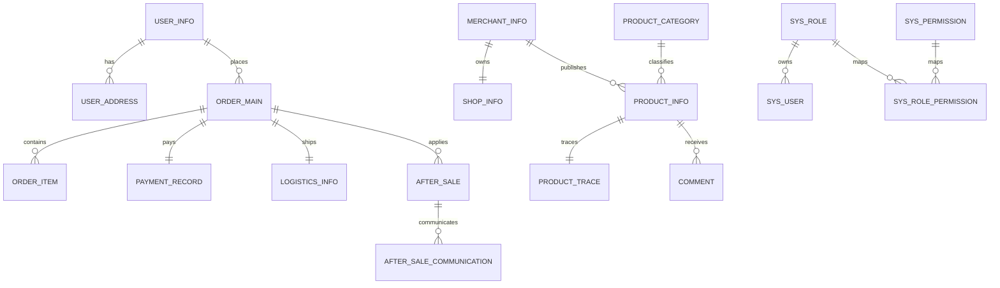
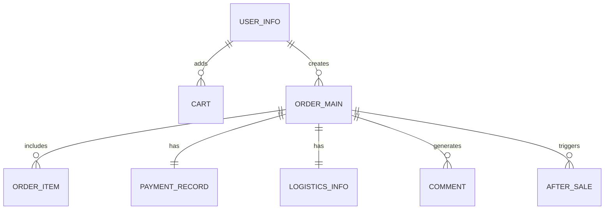
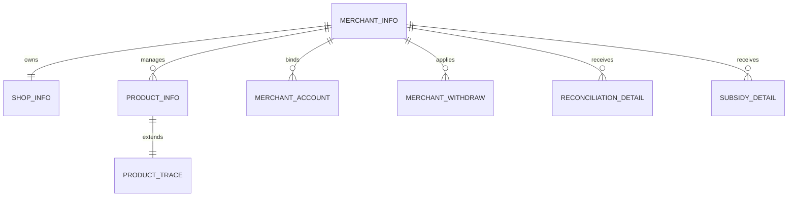
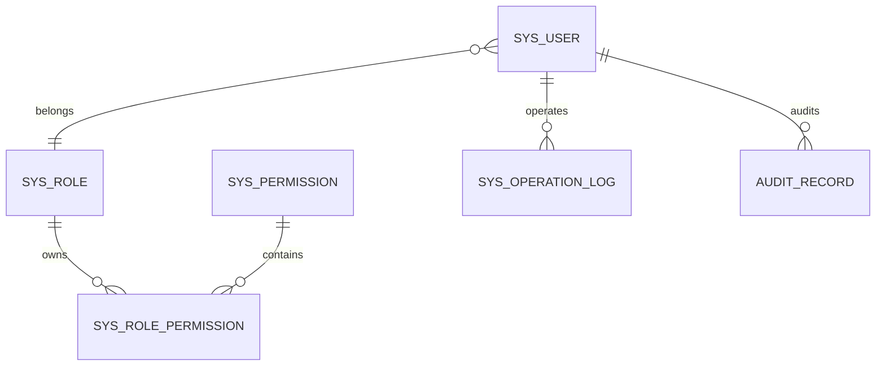

# 成都信息工程大学
Chengdu University of Information Technology
CUIT

# 本科毕业论文（设计）
# 数据库设计说明书

| 学 生 姓 名 | 罗俊杰 |
| ---- | ---- |
| 学号 | 2022081092 |
| 专业 | 软件工程 |
| 年级班级 | 2022级3班 |
| 指导教师 | 刘孙俊（副教授） |
| 所在学院 | 软件工程学院 |
| 提交日期 | 2026年4月 |

2026 年 4 月  
成都信息工程大学 软件工程学院

---

# 目录
1 引言  
1.1 编写目的  
1.2 项目背景  
1.3 术语  
1.4 参考资料  
2 需求分析  
2.1 数据流图  
2.2 数据字典  
3 E-R 模型设计  
3.1 实体及属性  
3.2 E-R 图  
4 数据库实现  
4.1 数据库命名约定和环境  
4.2 数据库关系图  
4.3 数据表信息  
4.4 存储过程信息  
5 数据库安全设计

---

# 1 引言
## 1.1 编写目的
本文档用于说明“基于 Web 的助农产品销售系统”的数据库设计方案，包括数据流、核心实体、表结构、索引策略和安全设计，为系统实现、调试、测试和论文撰写提供依据。

## 1.2 项目背景
本系统面向助农电商业务，数据层需要支持用户、商家、商品、溯源、订单、支付、售后、审核、日志、备份和资金监管等多类业务数据，并能够配合 Redis 缓存、WebSocket 实时推送和定时任务完成系统运行。

## 1.3 术语
| 术语 | 含义 |
| ---- | ---- |
| 业务主键 | 具有业务含义的唯一标识，如订单号、售后单号 |
| 逻辑删除 | 使用 `delete_flag` 标识软删除 |
| 外键关系 | 逻辑层面的主从关联，本项目多数通过代码维护 |
| 数据字典 | 对数据结构和数据项的统一定义 |

## 1.4 参考资料
1. 需求规格说明书；
2. 概要设计说明书；
3. 当前项目 `schema.sql`；
4. 当前项目后端实体类与表初始化代码；
5. MySQL 8.x 官方文档。

---

# 2 需求分析
## 2.1 数据流图
### 2.1.1 顶层数据流图

### 2.1.2 第 2 层数据流图

### 2.1.3 第 3 层数据流图：订单与售后子系统

## 2.2 数据字典
### 2.2.1 数据结构
| 序号 | 数据结构名 | 含义说明 | 组成 |
| ---- | ---- | ---- | ---- |
| 1 | 用户信息 | 普通消费者账号与资料 | 用户ID、手机号、昵称、密码、状态、创建时间 |
| 2 | 商家信息 | 商家账号与审核信息 | 商家ID、手机号、商家名称、联系人、审核状态、店铺状态 |
| 3 | 商品信息 | 商品基础属性 | 商品ID、商家ID、分类ID、价格、库存、状态、销量 |
| 4 | 溯源信息 | 商品种植与流通信息 | 商品ID、种植周期、产地详情、施肥类型、运输方式 |
| 5 | 订单信息 | 订单交易主流程 | 订单号、用户ID、商家ID、金额、状态、地址信息 |
| 6 | 支付信息 | 支付和退款信息 | 订单号、支付方式、支付状态、退款状态 |
| 7 | 售后信息 | 售后业务流程 | 售后单号、订单号、售后类型、原因、状态 |
| 8 | 审核信息 | 平台审核轨迹 | 业务类型、业务ID、审核人、审核状态、意见 |
| 9 | 权限信息 | 管理员角色权限 | 管理员、角色、权限和角色权限关联 |
| 10 | 运维信息 | 日志、备份、对账、提现 | 操作日志、对账记录、提现记录 |

### 2.2.2 数据项
| 序号 | 数据项名 | 数据描述 | 数据类型 | 取值范围 | 逻辑关系 |
| ---- | ---- | ---- | ---- | ---- | ---- |
| 1 | order_no | 订单编号 | varchar(32) | 唯一非空 | `order_main`、`order_item`、`payment_record`、`logistics_info`、`after_sale` 的关联键 |
| 2 | after_sale_no | 售后单号 | varchar(32) | 唯一非空 | `after_sale` 与 `after_sale_communication` 的关联键 |
| 3 | order_status | 订单状态 | tinyint | 1~8 | 控制订单主流程 |
| 4 | audit_status | 审核状态 | tinyint | 0/1/2 | 商家、评论、新闻、补贴等审核结果 |
| 5 | product_status | 商品状态 | tinyint | 0~3 | 决定商品是否可展示和购买 |
| 6 | withdraw_status | 提现状态 | tinyint | 0~6 | 控制提现打款过程 |
| 7 | delete_flag | 逻辑删除标志 | tinyint | 0/1 | 0 为有效，1 为删除 |
| 8 | total_amount | 订单总金额 | decimal(10,2) | 非负 | 与订单支付和对账金额关联 |

---

# 3 E-R 模型设计
## 3.1 实体及属性
本系统主要实体如下：

1. 用户实体：`user_info`、`user_address`
2. 商家实体：`merchant_info`、`shop_info`、`merchant_account`、`merchant_withdraw`
3. 商品实体：`product_category`、`product_info`、`product_trace`
4. 交易实体：`cart`、`order_main`、`order_item`、`payment_record`、`logistics_info`
5. 售后与内容实体：`after_sale`、`after_sale_communication`、`comment`、`news`、`news_category`
6. 后台治理实体：`sys_user`、`sys_role`、`sys_permission`、`sys_role_permission`、`audit_record`、`sys_operation_log`
7. 资金与运维实体：`reconciliation_detail`、`subsidy_detail`
8. 辅助消息实体：`order_communication`、`user_message`

## 3.2 E-R 图
### 3.2.1 总体 E-R 图

### 3.2.2 用户交易子域 E-R 图

### 3.2.3 商家经营子域 E-R 图

### 3.2.4 后台治理子域 E-R 图

---

# 4 数据库实现
## 4.1 数据库命名约定和环境
### 4.1.1 命名约定
1. 物理表名采用小写下划线命名法，如 `order_main`、`product_info`。
2. 主键字段统一使用 `id` 或业务唯一键，如 `order_no`、`after_sale_no`。
3. 逻辑删除字段统一使用 `delete_flag`。
4. 创建与更新时间统一使用 `create_time`、`update_time`。
5. 状态字段统一使用 `status`、`audit_status`、`order_status` 等命名方式。

### 4.1.2 数据库环境
1. 数据库管理系统：MySQL 8.x
2. 数据库名称：`nongnong_ecommerce`
3. 设计与管理工具：Navicat、MySQL 客户端
4. 缓存系统：Redis 6.x
5. 数据脚本来源：`agricultural/sql/schema.sql` 以及应用启动初始化逻辑

## 4.2 数据库关系图
数据库关系采用“业务主键 + 逻辑层维护”的方式实现，主要原因如下：

1. 系统中大量表通过业务编号关联，例如 `order_no` 和 `after_sale_no`；
2. 多数业务在 Service 层完成事务和一致性控制；
3. 为了降低开发和调试复杂度，数据库层更多采用索引和唯一约束，而不大量使用物理外键。

## 4.3 数据表信息
### 4.3.1 表列表
本项目当前数据库**实际共有 29 张表**，可分为“核心 27 张业务表”和“运行时自动初始化的 2 张辅助表”。

表来源说明如下：

| 表来源 | 数量 | 说明 |
| ---- | ---- | ---- |
| `schema.sql` 直接定义 | 27 | 构成系统主要业务数据结构 |
| 应用启动时自动初始化 | 2 | `user_message`、`order_communication` |

因此，在论文表述中应以“当前数据库共 29 张表”作为最终口径，而“27 张核心表”用于说明 `schema.sql` 的主体设计范围。

#### 核心业务表
| 序号 | 中文名称 | 物理表名 | 备注 |
| ---- | ---- | ---- | ---- |
| 1 | 管理员用户表 | sys_user | 系统基础 |
| 2 | 角色表 | sys_role | 系统基础 |
| 3 | 权限表 | sys_permission | 系统基础 |
| 4 | 角色权限关联表 | sys_role_permission | 系统基础 |
| 5 | 系统操作日志表 | sys_operation_log | 系统基础 |
| 6 | 消费者用户表 | user_info | 用户端 |
| 7 | 用户收货地址表 | user_address | 用户端 |
| 8 | 购物车表 | cart | 用户端 |
| 9 | 订单主表 | order_main | 交易核心 |
| 10 | 订单明细表 | order_item | 交易核心 |
| 11 | 支付记录表 | payment_record | 交易核心 |
| 12 | 物流信息表 | logistics_info | 交易核心 |
| 13 | 评论表 | comment | 用户反馈 |
| 14 | 售后表 | after_sale | 售后核心 |
| 15 | 售后沟通表 | after_sale_communication | 售后核心 |
| 16 | 新闻分类表 | news_category | 内容管理 |
| 17 | 新闻表 | news | 内容管理 |
| 18 | 商家信息表 | merchant_info | 商家端 |
| 19 | 店铺信息表 | shop_info | 商家端 |
| 20 | 商家收款账户表 | merchant_account | 商家端 |
| 21 | 商家提现表 | merchant_withdraw | 商家端 |
| 22 | 商品分类表 | product_category | 商品域 |
| 23 | 商品信息表 | product_info | 商品域 |
| 24 | 商品溯源表 | product_trace | 商品域 |
| 25 | 对账明细表 | reconciliation_detail | 资金域 |
| 26 | 补贴明细表 | subsidy_detail | 资金域 |
| 27 | 审核记录表 | audit_record | 平台治理 |

#### 运行时辅助表
| 序号 | 中文名称 | 物理表名 | 备注 |
| ---- | ---- | ---- | ---- |
| 28 | 用户消息表 | user_message | 启动时自动初始化 |
| 29 | 订单沟通表 | order_communication | 启动时自动初始化 |

两张辅助表虽然不是直接写在 `schema.sql` 中，但它们已经在当前系统运行中承担真实业务职责：

1. `user_message` 用于存储用户侧系统通知、售后通知和裁决通知；
2. `order_communication` 用于存储订单实时沟通消息及媒体信息；
3. 两张表均在系统启动阶段自动建表，因此属于当前数据库实际组成部分，而不是临时测试表。

### 4.3.2 重点数据表设计
以下列出系统中关键业务表的设计说明。

#### 表 1：管理员用户表
| 项目 | 内容 |
| ---- | ---- |
| 中文名称 | 管理员用户表 |
| 物理表名 | sys_user |
| 主键 | id |
| 业务主键 | username |
| 主要索引 | `uk_sys_user_username`、`idx_role_id`、`idx_phone` |
| 作用 | 存储管理员登录信息、角色绑定和状态 |

| 序号 | 中文名称 | 列名 | 数据类型 | 非空 | 说明 |
| ---- | ---- | ---- | ---- | ---- | ---- |
| 1 | 管理员ID | id | bigint | 是 | 主键 |
| 2 | 登录账号 | username | varchar(50) | 是 | 唯一 |
| 3 | 密码 | password | varchar(100) | 是 | BCrypt 密码 |
| 4 | 角色ID | role_id | bigint | 是 | 关联角色 |
| 5 | 状态 | status | tinyint | 否 | 0 禁用，1 正常 |

#### 表 2：用户表
| 项目 | 内容 |
| ---- | ---- |
| 中文名称 | 消费者用户表 |
| 物理表名 | user_info |
| 主键 | id |
| 业务主键 | phone |
| 主要索引 | `uk_phone`、`idx_login_token` |
| 作用 | 存储用户账号与个人信息 |

| 序号 | 中文名称 | 列名 | 数据类型 | 非空 | 说明 |
| ---- | ---- | ---- | ---- | ---- | ---- |
| 1 | 用户ID | id | bigint | 是 | 主键 |
| 2 | 手机号 | phone | varchar(11) | 是 | 唯一 |
| 3 | 昵称 | nickname | varchar(50) | 否 | 用户昵称 |
| 4 | 密码 | password | varchar(100) | 否 | 密码登录使用 |
| 5 | 状态 | status | tinyint | 否 | 账号状态 |

#### 表 3：商家信息表
| 项目 | 内容 |
| ---- | ---- |
| 中文名称 | 商家信息表 |
| 物理表名 | merchant_info |
| 主键 | id |
| 业务主键 | phone |
| 主要索引 | `uk_phone`、`idx_audit_status`、`idx_status` |
| 作用 | 存储商家账号、审核结果和经营状态 |

#### 表 4：商品信息表
| 项目 | 内容 |
| ---- | ---- |
| 中文名称 | 商品信息表 |
| 物理表名 | product_info |
| 主键 | id |
| 业务主键 | 无 |
| 主要索引 | `idx_merchant_id`、`idx_category_id`、`idx_status`、`idx_sales_volume` |
| 作用 | 存储商品核心属性、库存和展示状态 |

| 序号 | 中文名称 | 列名 | 数据类型 | 非空 | 说明 |
| ---- | ---- | ---- | ---- | ---- | ---- |
| 1 | 商品ID | id | bigint | 是 | 主键 |
| 2 | 商品名称 | product_name | varchar(100) | 是 | 商品标题 |
| 3 | 商家ID | merchant_id | bigint | 是 | 所属商家 |
| 4 | 分类ID | category_id | bigint | 是 | 商品分类 |
| 5 | 价格 | price | decimal(10,2) | 是 | 销售价 |
| 6 | 库存 | stock | int | 是 | 当前库存 |
| 7 | 状态 | status | tinyint | 否 | 0 待审核，1 已上架，2 已下架，3 已驳回 |
| 8 | 销量 | sales_volume | int | 否 | 用于热销排行 |

#### 表 5：商品溯源表
| 项目 | 内容 |
| ---- | ---- |
| 中文名称 | 商品溯源信息表 |
| 物理表名 | product_trace |
| 主键 | id |
| 业务主键 | product_id |
| 主要索引 | `uk_product_id` |
| 作用 | 存储种植、保存、运输和二维码信息 |

#### 表 6：订单主表
| 项目 | 内容 |
| ---- | ---- |
| 中文名称 | 订单主表 |
| 物理表名 | order_main |
| 主键 | id |
| 业务主键 | order_no |
| 主要索引 | `uk_order_no`、`idx_user_id`、`idx_merchant_id`、`idx_order_status` |
| 作用 | 存储订单总体状态、金额和收货信息 |

| 序号 | 中文名称 | 列名 | 数据类型 | 非空 | 说明 |
| ---- | ---- | ---- | ---- | ---- | ---- |
| 1 | 订单ID | id | bigint | 是 | 主键 |
| 2 | 订单号 | order_no | varchar(32) | 是 | 业务唯一键 |
| 3 | 用户ID | user_id | bigint | 是 | 下单用户 |
| 4 | 商家ID | merchant_id | bigint | 是 | 所属商家 |
| 5 | 总金额 | total_amount | decimal(10,2) | 是 | 订单金额 |
| 6 | 订单状态 | order_status | tinyint | 是 | 1~8 |
| 7 | 支付截止时间 | pay_deadline | datetime | 否 | 超时取消依据 |

#### 表 7：订单明细表
| 项目 | 内容 |
| ---- | ---- |
| 中文名称 | 订单明细表 |
| 物理表名 | order_item |
| 主键 | id |
| 业务主键 | 无 |
| 主要索引 | `idx_order_no`、`idx_product_id` |
| 作用 | 存储订单中具体商品项 |

#### 表 8：支付记录表
| 项目 | 内容 |
| ---- | ---- |
| 中文名称 | 支付记录表 |
| 物理表名 | payment_record |
| 主键 | id |
| 业务主键 | 无 |
| 主要索引 | `idx_order_no`、`idx_pay_status` |
| 作用 | 存储模拟支付与退款信息 |

#### 表 9：售后表
| 项目 | 内容 |
| ---- | ---- |
| 中文名称 | 售后表 |
| 物理表名 | after_sale |
| 主键 | id |
| 业务主键 | after_sale_no |
| 主要索引 | `uk_after_sale_no`、`idx_order_no`、`idx_merchant_id`、`idx_after_sale_status` |
| 作用 | 存储售后申请、状态和处理结果 |

| 序号 | 中文名称 | 列名 | 数据类型 | 非空 | 说明 |
| ---- | ---- | ---- | ---- | ---- | ---- |
| 1 | 售后ID | id | bigint | 是 | 主键 |
| 2 | 售后单号 | after_sale_no | varchar(32) | 是 | 唯一业务键 |
| 3 | 订单号 | order_no | varchar(32) | 是 | 关联订单 |
| 4 | 售后类型 | after_sale_type | tinyint | 是 | 1 退款，2 退货退款，3 换货 |
| 5 | 申请原因 | apply_reason | varchar(50) | 是 | 售后原因 |
| 6 | 售后状态 | after_sale_status | tinyint | 是 | 1~6 |
| 7 | 处理结果 | handle_result | varchar(200) | 否 | 处理说明 |

#### 表 10：评论表
| 项目 | 内容 |
| ---- | ---- |
| 中文名称 | 商品评价表 |
| 物理表名 | comment |
| 主键 | id |
| 业务主键 | 无 |
| 主要索引 | `idx_product_id`、`idx_user_id`、`idx_order_no`、`idx_audit_status` |
| 作用 | 存储评价内容、评分和审核状态 |

#### 表 11：审核记录表
| 项目 | 内容 |
| ---- | ---- |
| 中文名称 | 审核记录表 |
| 物理表名 | audit_record |
| 主键 | id |
| 业务主键 | 无 |
| 主要索引 | `idx_business_type_id`、`idx_audit_user_id` |
| 作用 | 存储商家、商品、评论等后台审核记录 |

#### 表 12：操作日志表
| 项目 | 内容 |
| ---- | ---- |
| 中文名称 | 系统操作日志表 |
| 物理表名 | sys_operation_log |
| 主键 | id |
| 业务主键 | 无 |
| 主要索引 | `idx_operator_id`、`idx_business_type_id`、`idx_create_time` |
| 作用 | 存储管理员后台操作日志 |

#### 表 13：对账明细表
| 项目 | 内容 |
| ---- | ---- |
| 中文名称 | 对账明细表 |
| 物理表名 | reconciliation_detail |
| 主键 | id |
| 业务主键 | 无 |
| 主要索引 | `idx_merchant_id`、`idx_order_no`、`idx_transfer_status` |
| 作用 | 存储订单打款、营收和服务费信息 |

#### 表 14：提现申请表
| 项目 | 内容 |
| ---- | ---- |
| 中文名称 | 商家提现申请表 |
| 物理表名 | merchant_withdraw |
| 主键 | id |
| 业务主键 | withdraw_no |
| 主要索引 | `uk_withdraw_no`、`idx_merchant_status`、`idx_status_retry` |
| 作用 | 存储商家提现申请及打款重试状态 |

#### 表 15：用户消息表
| 项目 | 内容 |
| ---- | ---- |
| 中文名称 | 用户消息表 |
| 物理表名 | user_message |
| 主键 | id |
| 业务主键 | 无 |
| 主要索引 | `idx_user_id`、`idx_user_read` |
| 作用 | 存储订单、售后、评论等通知消息 |

#### 表 16：订单沟通表
| 项目 | 内容 |
| ---- | ---- |
| 中文名称 | 订单沟通表 |
| 物理表名 | order_communication |
| 主键 | id |
| 业务主键 | 无 |
| 主要索引 | `idx_order_no`、`idx_order_time`、`idx_sender` |
| 作用 | 存储订单沟通消息、消息类型和媒体地址 |

| 序号 | 中文名称 | 列名 | 数据类型 | 非空 | 说明 |
| ---- | ---- | ---- | ---- | ---- | ---- |
| 1 | 消息ID | id | bigint | 是 | 主键 |
| 2 | 订单号 | order_no | varchar(64) | 是 | 关联订单 |
| 3 | 发送者类型 | sender_type | tinyint | 是 | 1 用户，2 商家，3 管理员 |
| 4 | 发送者ID | sender_id | bigint | 是 | 消息发送者 |
| 5 | 消息类型 | message_type | tinyint | 是 | 1 文本，2 图片，3 视频 |
| 6 | 消息内容 | content | varchar(1000) | 是 | 文本内容 |
| 7 | 媒体地址 | media_url | varchar(255) | 否 | 图片或视频地址 |

### 4.3.3 表设计补充说明
1. 当前系统所有核心业务表均统一采用 `bigint` 主键，便于扩展。
2. 业务编号如 `order_no`、`after_sale_no` 被用于前后端交互和业务查询。
3. 大多数业务表带有 `delete_flag` 逻辑删除字段。
4. 高并发读多写少场景通过 Redis 缓存缓解数据库查询压力。
5. `user_message` 和 `order_communication` 不在 `schema.sql` 中直接定义，而是在系统启动阶段自动初始化，属于当前项目实际运行的一部分。
6. 因此，数据库设计说明书在章节总览上采用 29 张表口径，在脚本来源分析上采用 27 + 2 的拆分口径。

## 4.4 存储过程信息
本系统当前未使用 MySQL 存储过程或自定义函数，核心业务逻辑均在 Spring Boot 业务层中实现，因此本节不展开存储过程设计。

---

# 5 数据库安全设计
## 5.1 主键、唯一约束与索引设计
1. 管理员账号、用户手机号、商家手机号、角色编码、权限编码等字段设置唯一约束。
2. 订单号、售后单号、提现单号设置业务唯一键。
3. 对高频查询字段建立索引，如用户 ID、商家 ID、订单状态、审核状态、创建时间等。

## 5.2 逻辑删除与数据追踪
1. 主要业务表统一采用 `delete_flag` 逻辑删除。
2. 多数核心表保留 `create_time` 和 `update_time` 字段。
3. 审核记录和操作日志用于追踪后台管理行为。

## 5.3 密码与敏感数据
1. 用户、商家和管理员密码采用加密方式存储，不保存明文密码。
2. 登录验证通过 JWT 和业务校验控制访问权限。
3. 管理员后台接口额外要求登录类型和权限校验。

## 5.4 缓存与权限辅助
1. Redis 用于缓存首页、商品详情、搜索结果、新闻列表、滞销专区等公共数据。
2. Redis 也用于热门商品排行和管理员权限快照缓存。
3. 缓存失效策略由业务更新时主动清理，减少脏数据问题。

## 5.5 数据一致性与恢复设计
1. 订单、支付、库存、售后等关键业务由服务层事务统一维护一致性。
2. 超时取消订单时，系统会同步回滚库存、销量和部分缓存数据。
3. 备份采用全表数据导出策略，适合当前毕业设计和轻量运维场景。
4. 恢复操作基于备份 SQL 文件执行，恢复前应确认目标环境与表结构版本一致。

## 5.6 备份与恢复
1. 系统支持每日自动备份。
2. 管理员后台支持手动生成 SQL 备份文件。
3. 备份恢复基于 SQL 脚本执行完成。
4. 当前备份属于数据级备份，适合毕业设计和轻量演示场景。

## 5.7 数据库安全结论
本系统数据库设计遵循“结构清晰、约束适度、索引合理、便于维护”的原则，在满足本科毕业设计复杂度要求的同时，也兼顾了后续扩展空间。数据库能够支撑用户交易、商家经营、平台治理和系统运维等主要业务场景。
